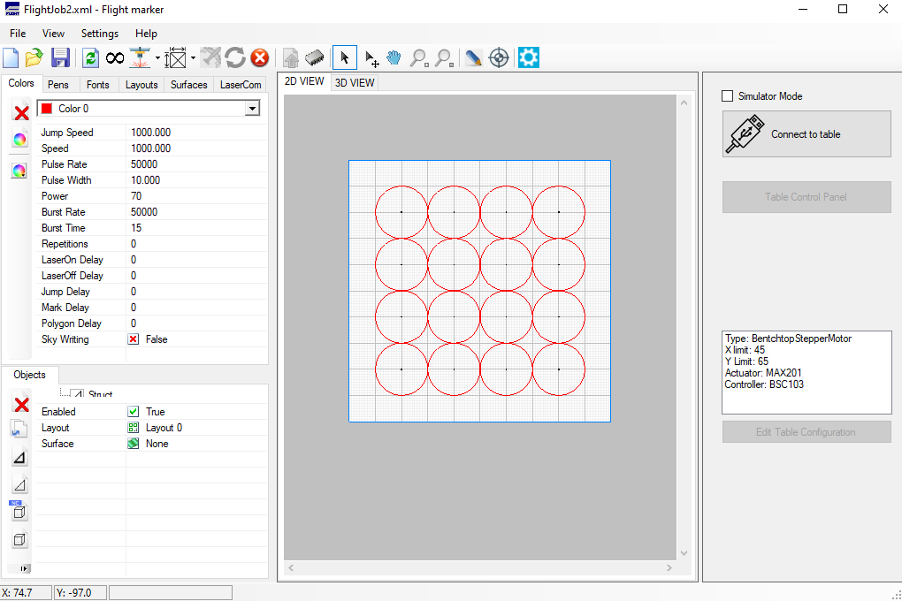
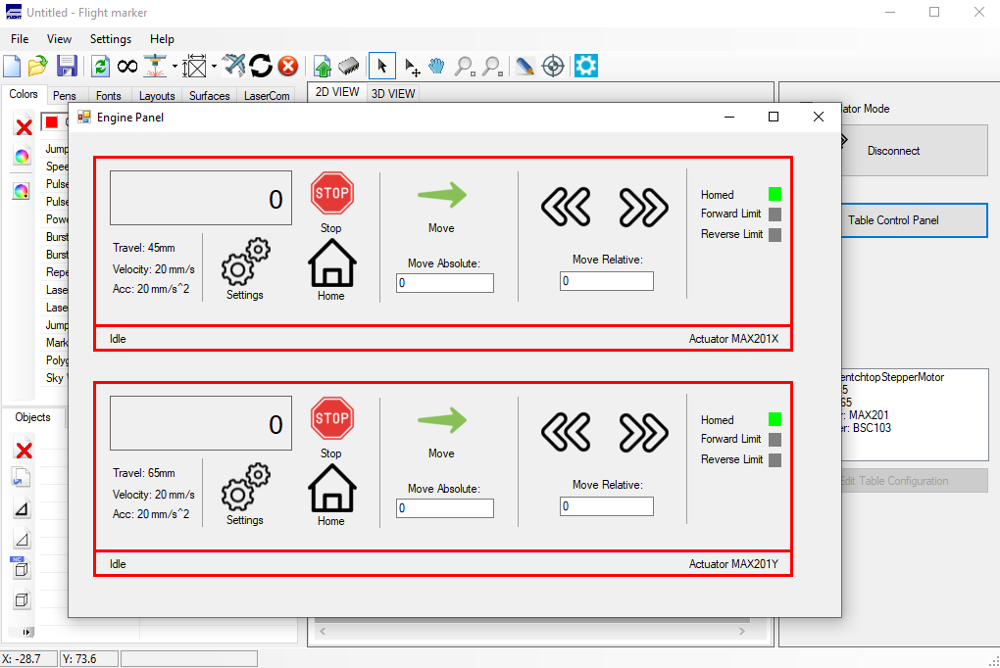
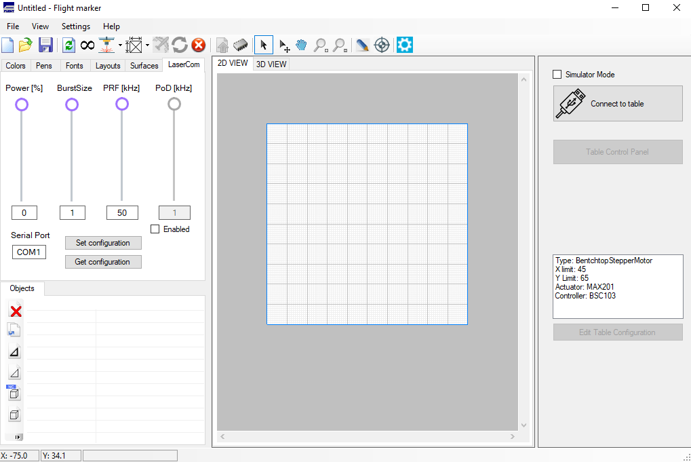

# Description
Flight Laser is an open-source template that allows to integrate laser marking technology into software environments.
 

    

 
The program has been expanded to include an implementation of on-the-fly technology, which makes it possible to produce laser processing geometries with size greater than field of view of the scanning lens. The aim of this project was to create an application, that extends the existing Flight software with additional functionalities, allowing the optical head, linear table and laser to be controlled within a single application. The program was created in C# programming language, based on the manufacturers documentation. Table control module and control panel associated with it, implemented several basic movement functions, such as: Move Absolute or Move Relative. 
  

    

 
A class responsible for communicating with the laser using the RS-232 serial communication protocol has also been created. 
  

    

 
The algorithm used for controlling the deflection was based on compensating the laser beam depending on the current position of the table. In one of the solutions, the position of the table was estimated based on the assumption of its constant movement speed. The second solution used feedback in the form of a signals from encoders that were attached to the table.
  
Other features include: generating a laser parameter layout, simulating the machining area and changing hatching style during the process. 
